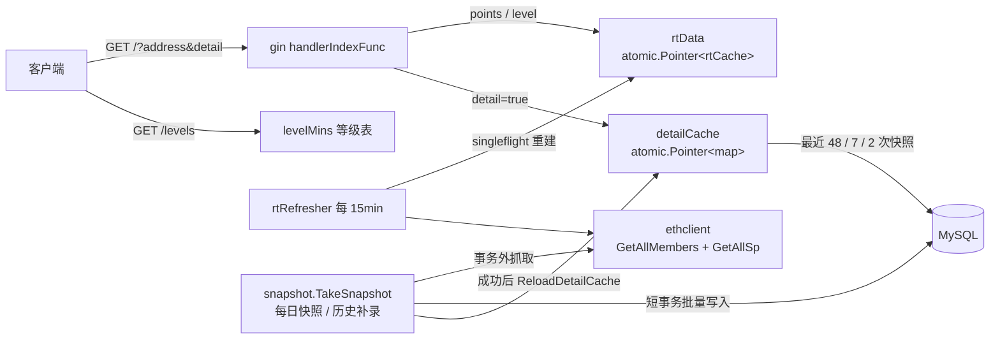

```mermaid
flowchart LR
    C[客户端] -->|GET /?address&detail| G[gin handlerIndexFunc]
    C -->|GET /levels| L[levelMins 等级表]
    G -->|points / level| RT[rtData<br/>atomic.Pointer&lt;rtCache&gt;]
    G -->|detail=true| DC[detailCache<br/>atomic.Pointer&lt;map&gt;]
    R[rtRefresher 每 15min] -->|singleflight 重建| RT
    R --> E[ethclient<br/>GetAllMembers + GetAllSp]
    S[snapshot.TakeSnapshot<br/>每日快照 / 历史补录] -->|事务外抓取| E
    S -->|短事务批量写入| DB[(MySQL)]
    S -->|成功后 ReloadDetailCache| DC
    DC -->|最近 48 / 7 / 2 次快照| DB
```